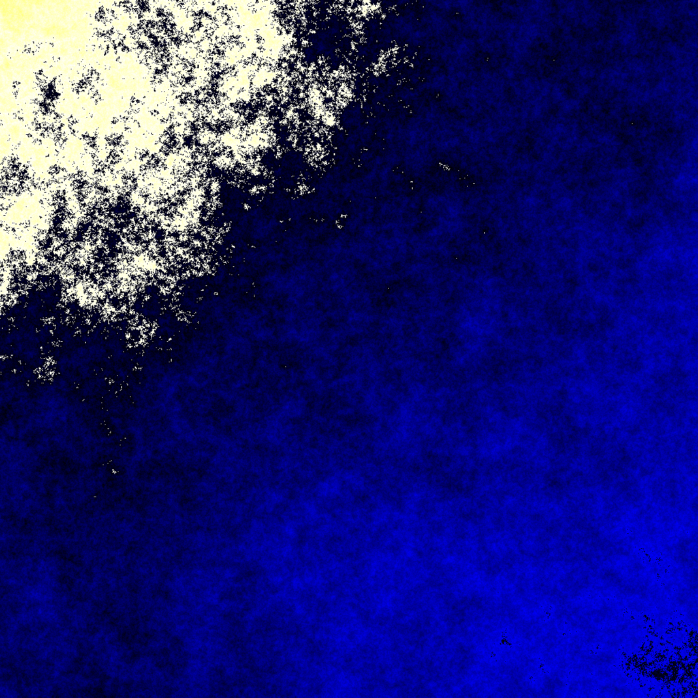

# terrain-interpolator
[TDD lesson](http://blog.cleancoder.com/uncle-bob/2017/01/09/DiamondSquare.html)

[Diamond Square algorithm definition](https://en.wikipedia.org/wiki/Diamond-square_algorithm)

Sample 1025x1025 size image

